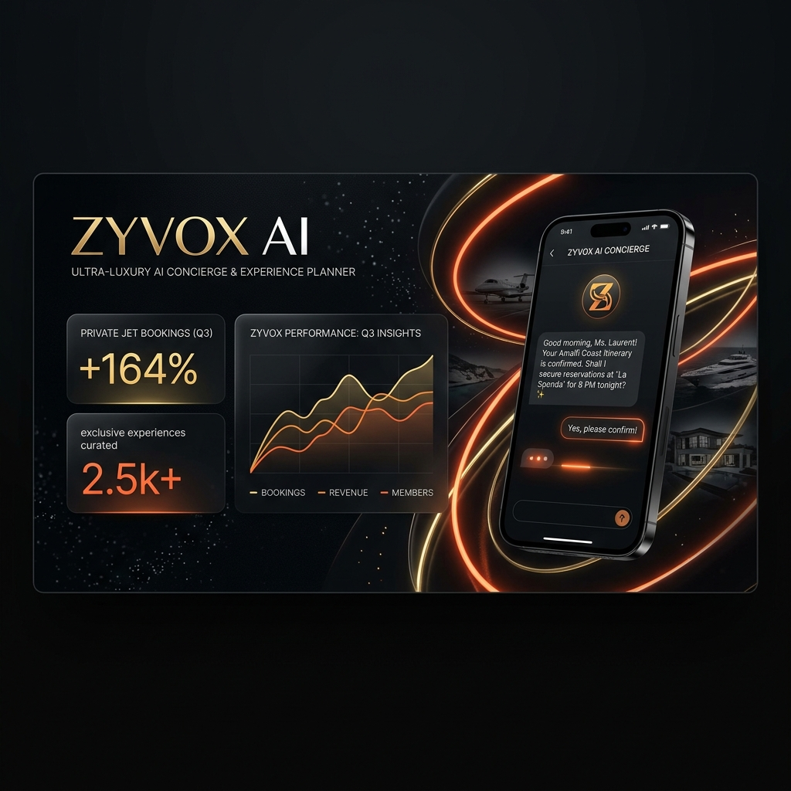
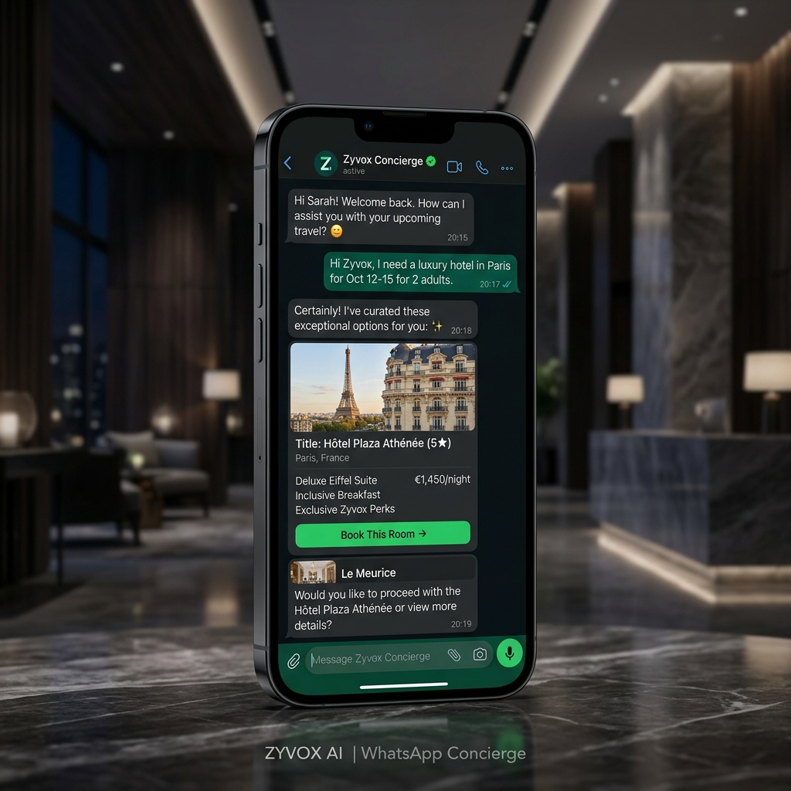
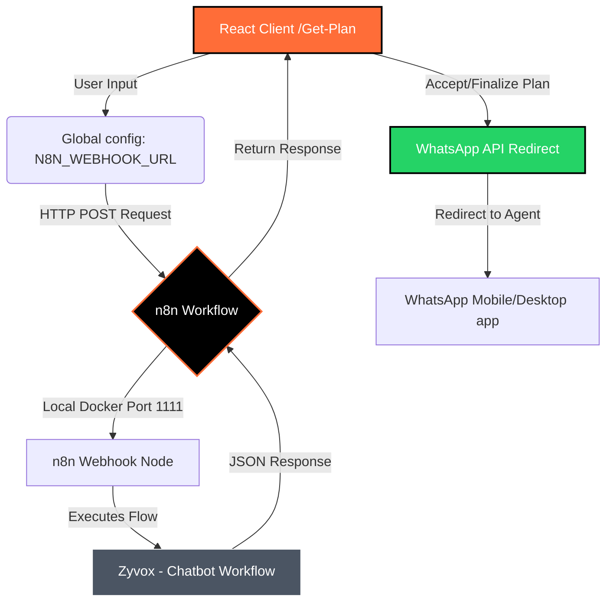

# ZYVOX AI Concierge

<div align="center">

<!-- Animated Header Logo -->
<svg viewBox="0 0 800 160" xmlns="http://www.w3.org/2000/svg" style="width: 100%; max-width: 800px; background: #0c0a09; border-radius: 16px; box-shadow: 0 10px 30px rgba(0,0,0,0.5); margin-bottom: 24px;">
  <defs>
    <linearGradient id="orangeGold" x1="0%" y1="0%" x2="100%" y2="0%">
      <stop offset="0%" stop-color="#ff6d38" />
      <stop offset="50%" stop-color="#ff8d60" />
      <stop offset="100%" stop-color="#ffa852" />
    </linearGradient>
    <filter id="glow" x="-20%" y="-20%" width="140%" height="140%">
      <feGaussianBlur stdDeviation="6" result="blur" />
      <feMerge>
        <feMergeNode in="blur" />
        <feMergeNode in="SourceGraphic" />
      </feMerge>
    </filter>
  </defs>
  
  <!-- Glowing Animated Circuit Line -->
  <path d="M 50 130 H 750" stroke="url(#orangeGold)" stroke-width="3" stroke-linecap="round" stroke-dasharray="700" stroke-dashoffset="700" opacity="0.6">
    <animate attributeName="stroke-dashoffset" values="700;0;700" dur="4s" repeatCount="indefinite" />
  </path>
  
  <!-- Pulse dots -->
  <circle cx="50" cy="130" r="4" fill="#ff6d38">
    <animate attributeName="r" values="4;8;4" dur="2s" repeatCount="indefinite" />
  </circle>
  <circle cx="750" cy="130" r="4" fill="#ffa852">
    <animate attributeName="r" values="4;8;4" dur="2s" repeatCount="indefinite" />
  </circle>

  <!-- Logo Text -->
  <text x="50%" y="75" font-family="'Montserrat', 'Outfit', 'Inter', sans-serif" font-size="56" font-weight="900" letter-spacing="12" fill="url(#orangeGold)" text-anchor="middle" filter="url(#glow)">
    ZYVOX AI
    <animate attributeName="opacity" values="0.85;1;0.85" dur="3s" repeatCount="indefinite" />
  </text>
  
  <!-- Subtitle -->
  <text x="50%" y="110" font-family="'Inter', sans-serif" font-size="11" font-weight="700" letter-spacing="6" fill="#a8a29e" text-anchor="middle">
    HYPER-LUXURY AI CONCIERGE & WORKFLOW AUTOMATION
  </text>
</svg>

[](https://vite.dev/)
[](https://react.dev/)
[](https://n8n.io/)
[](https://tailwindcss.com/)
[](https://www.framer.com/motion/)

*Zyvox AI is an elite, high-end travel experience and concierge planner. Running on React 19 + Vite 7, styled with premium custom animations and Tailwind, it links directly to local/cloud n8n workflows to generate ultra-luxury custom itineraries and seamlessly hand off bookings to WhatsApp agents.*

</div>

---

## 🌟 Visual Preview

### 🖥️ Main Concierge Hub Banner


### 💬 WhatsApp Integration Flow


---

## 🚀 Key Features

* **🎭 Immersive Micro-Animations**: Smooth page transitions, glowing hover feedback, glassmorphism containers, and custom typography powered by `Framer Motion` and `GSAP`.
* **🤖 Concierge AI Chatbot**: Real-time interactive messaging window utilizing unique session IDs stored in local storage for session memory.
* **⚡ n8n Webhook Integration**: Fully decoupled architecture where chat requests are processed by a local/cloud n8n agent workflow that dynamically structures responses.
* **📱 WhatsApp Handoff Booking**: Instantly transfers the finalized high-ticket itinerary details over to a member concierge agent on WhatsApp via custom web redirection.
* **⚙️ Centralized Configuration**: Easy variables management via `src/config.js` with instant support for custom environment file bindings.

---

## 📊 System Architecture



---

## ⚙️ Configuration Setup

Global endpoints are managed in [src/config.js](file:///d:/Zyvox%20&%20Finexa/Zyvox%20AI/Zyvox%20AI/src/config.js):

```javascript
// src/config.js
export const N8N_WEBHOOK_URL = import.meta.env.VITE_N8N_WEBHOOK_URL || "https://wto-talent-apt-screenshot.trycloudflare.com/webhook/591a4f49-ef7f-443f-9374-13120ae3dc94";
```

* To change the n8n webhook URL locally, update this variable or set the `VITE_N8N_WEBHOOK_URL` in your `.env` configuration file.

---

## 💻 Installation & Getting Started

### 1. Clone the repository and install dependencies
```bash
cd "Zyvox AI"
npm install
```

### 2. Configure n8n Workflow
Import the exported workflows from the `Workflow/` folder into your local or cloud n8n instance:
* `Workflow/Zyvox - Chatbot.json` (Main AI agent node configuration)
* `Workflow/Zyvox AI - Email.json` (Automation setup)

### 3. Run Development Server
```bash
npm run dev
```
*The React client will launch on `http://localhost:5174/` (or next free port).*

---

## 🎨 Development Aesthetics

* **Typography**: Outfitted with premium fonts like Montserrat, Outfit, and Inter.
* **Colors**: Curated palette containing deep rich shades:
  * `#0c0a09` (Stone Dark)
  * `#FDF8F3` (Soft Concierge Cream)
  * `#ff6d38` (Vibrant Coral/Orange Accent)
  * `#25D366` (WhatsApp Green)
